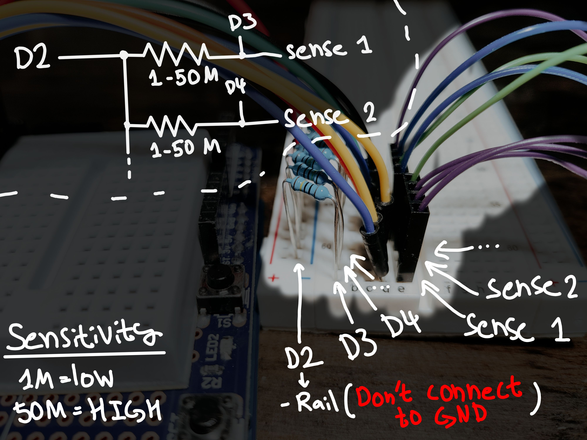
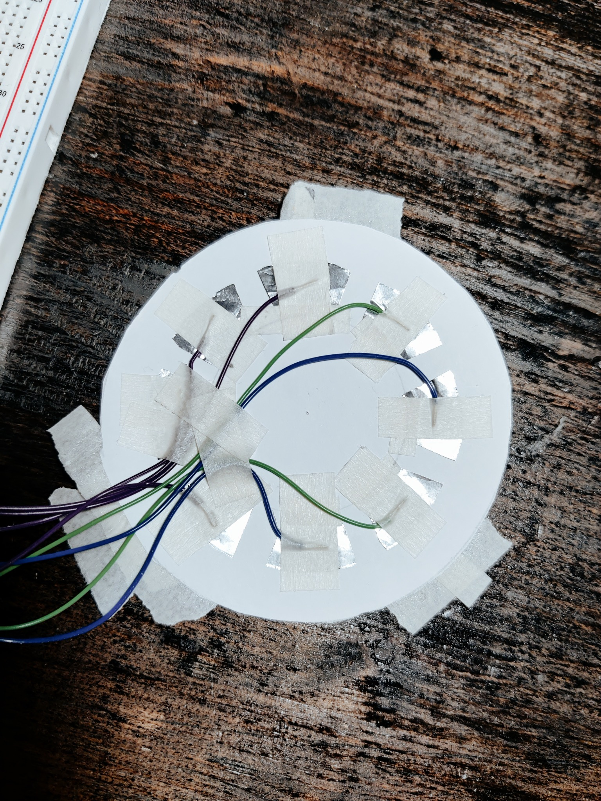

# ArduinoCapacitiveSensorDemo
A simple demonstration for how to use Arduino as a capacitive detector with the CapacitiveSensor -library
#### NOTE: Do not leave a single resistor unconnected, that will freeze the code! :3

### Programs:
* Arduino - cap_sens_rotary.ino - A rotary encoder demo with CapacitiveSensor -library (8 x contacts)
* Arduino - cap_sens_simple.ino - A simple single sensor demo

### A video about this project:

### How to connect stuff:

### How to arrange the pads:

